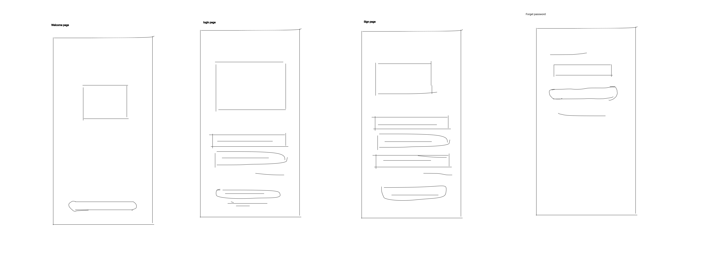
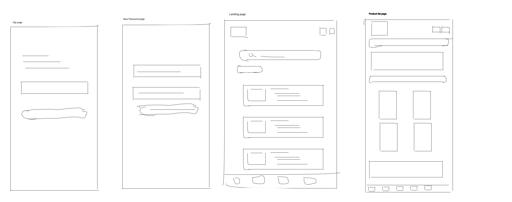

# Mobile App Wireframing

## 📌 Overview

This project focuses on designing low-fidelity wireframes for a mobile application. The goal is to plan the app structure and layout before visual design.

## 🎯 Objective

To create a simple, clear, and user-friendly wireframe for a mobile app.

## 🛠 Tool Used

* Figma

## 📱 Screens Included

* Login Screen
* Input/Form Screen
* Details Screen
* List/Home Screen
  
## 📷 Preview

## 🔗 Figma Link

https://www.figma.com/proto/EqX7QeWlJzwYYuYJpXoig6/Untitled?node-id=328-404&t=TKNyLqD8BmehT70J-1
# mobile-app-wireframing
This project showcase low-fidelity wireframes for a mobile application,focusing on layout,structure,and user flow.The design includes login,form,and home screens created using figma.  User flow:Login ->Form ->Home
